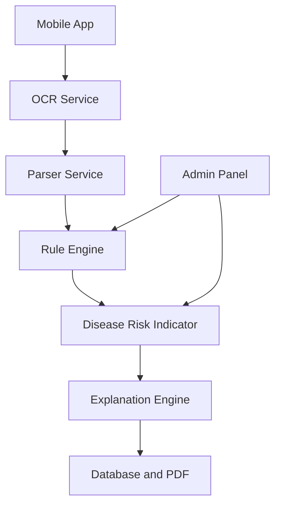
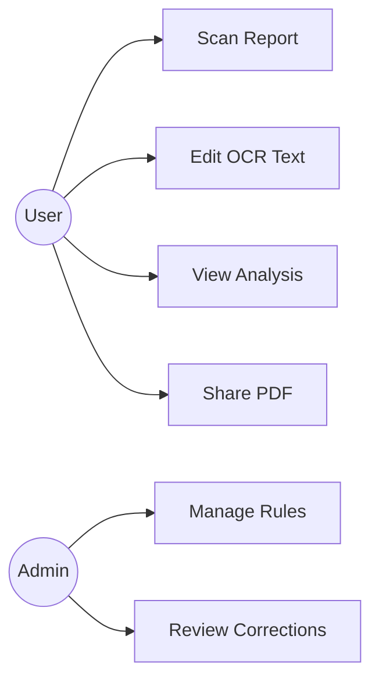
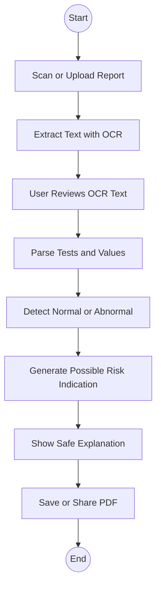
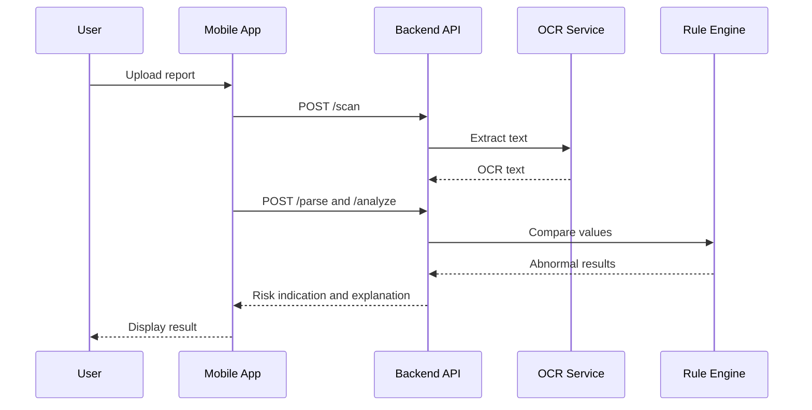
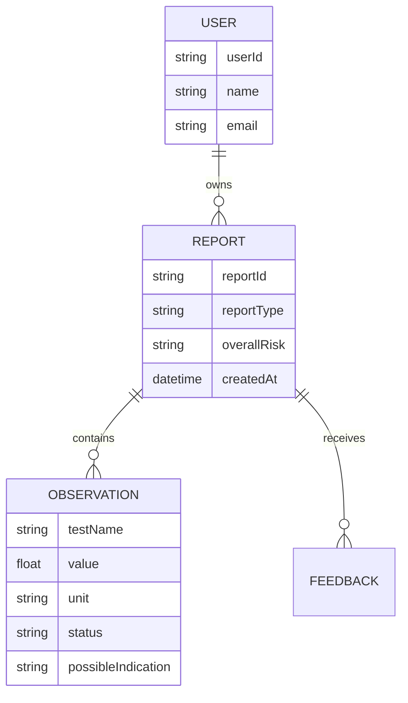

# Design Document — MediReport AI

## Architecture

```mermaid
flowchart TD
    A[Mobile App] --> B[OCR Service]
    B --> C[Parser Service]
    C --> D[Rule Engine]
    D --> E[Disease Risk Indicator]
    E --> F[Explanation Engine]
    F --> G[Database and PDF]
    H[Admin Panel] --> D
    H --> E
```

## Use Case Diagram

```mermaid
flowchart LR
    User((User)) --> Scan[Scan Report]
    User --> Preview[Edit OCR Text]
    User --> View[View Analysis]
    User --> Share[Share PDF]
    Admin((Admin)) --> Rules[Manage Rules]
    Admin --> Feedback[Review Corrections]
```

## Activity Diagram

```mermaid
flowchart TD
    Start((Start)) --> Scan[Scan or Upload Report]
    Scan --> OCR[Extract Text with OCR]
    OCR --> Preview[User Reviews OCR Text]
    Preview --> Parse[Parse Tests and Values]
    Parse --> Analyze[Detect Normal or Abnormal]
    Analyze --> Risk[Generate Possible Risk Indication]
    Risk --> Explain[Show Safe Explanation]
    Explain --> Save[Save or Share PDF]
    Save --> End((End))
```

## Sequence Diagram

```mermaid
sequenceDiagram
    participant U as User
    participant M as Mobile App
    participant B as Backend API
    participant O as OCR Service
    participant R as Rule Engine
    U->>M: Upload report
    M->>B: POST /scan
    B->>O: Extract text
    O-->>B: OCR text
    M->>B: POST /parse and /analyze
    B->>R: Compare values
    R-->>B: Abnormal results
    B-->>M: Risk indication and explanation
    M-->>U: Display result
```

## ERD

```mermaid
erDiagram
    USER ||--o{ REPORT : owns
    REPORT ||--o{ OBSERVATION : contains
    REPORT ||--o{ FEEDBACK : receives
    USER {
      string userId
      string name
      string email
    }
    REPORT {
      string reportId
      string reportType
      string overallRisk
      datetime createdAt
    }
    OBSERVATION {
      string testName
      float value
      string unit
      string status
      string possibleIndication
    }
```
